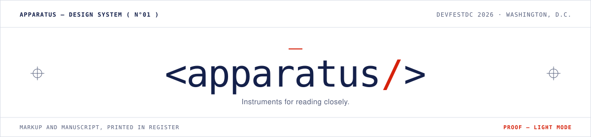
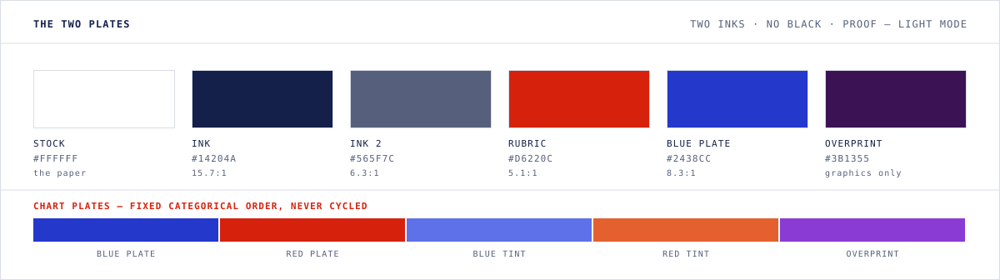
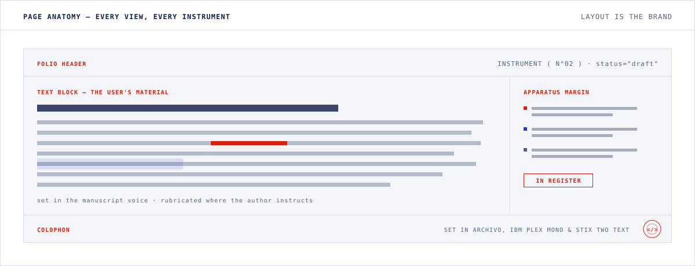

<picture>
  <source media="(prefers-color-scheme: dark)" srcset="assets/masthead-negative.svg">
  
</picture>

<p align="center">
  <em>The shared visual system for the DevFestDC 2026 build-a-thon — one hub and five small<br>
  digital-humanities instruments, built by separate hands and deployed as one product.</em>
</p>

---

Five apps written independently will not look like one product by accident. This
repository is the contract that makes them cohere: a specification thorough enough that
an agent can read it once and produce work indistinguishable from the other four.

Everything here "prints" in **two inks on stark white stock** — a duotone, the way
two-color process printing works. The blue plate is the *manuscript layer*: all text,
all structure. The red plate is the *markup layer*: instruction, emphasis, and live
state. There is no black anywhere in the system.

## Why it looks this way

Digital humanities is the act of laying rigorous structure — markup, ontologies,
schemas — over humanistic material. This system performs the same act visually, so the
interface argues for the same thing the work does.

- **The material outranks the tool.** Every screen is composed like a page from a
  critical edition: the text, corpus, or ontology holds the center with the most space
  and the quietest frame; controls recede to a margin.
- **Rubrication is borrowed, not invented.** Red ink reserved for headings and
  instruction is a scholarly convention a thousand years older than brand color — so
  the accent carries meaning to this audience rather than decoration.
- **The type can hold a source text.** STIX Two Text ships Greek, critical signs, and
  combining diacritics, so a corpus never falls back to a system font mid-sentence.
- **Pages that describe themselves.** Folio headers, registry numbers, and `status`
  attributes mirror how a scholarly edition announces what it is and how far along.
- **Legibility is a scholarly value.** Every text color clears WCAG AA on its ground in
  both modes, and the chart palettes are machine-validated for color-vision deficiency —
  research is read for hours at a time.

## The two plates

<picture>
  <source media="(prefers-color-scheme: dark)" srcset="assets/plates-negative.svg">
  
</picture>

Light mode is the **Proof** (inks on white stock). Dark mode is the **Negative** (the
film negative — stock and ink swap, and the plates lighten to hold contrast). It is a
selected palette with its own validated values, never an automatic inversion. *The
figures above are printing in whichever mode you are reading in.*

Red answers exactly one question: *is this an instruction, an authored emphasis, or
something happening right now?* If not, it is not red. Blue means you can click,
follow, or select it. Charts draw from the same two plates, so the palette is the brand.

## Page anatomy

<picture>
  <source media="(prefers-color-scheme: dark)" srcset="assets/anatomy-negative.svg">
  
</picture>

Layout is what actually holds the suite together — tokens alone would not. Every view in
every instrument carries the same four regions, so a user moving between tools stays on
the same page.

## What's in here

| File | What it is |
|---|---|
| **[`DESIGN-BRIEF.md`](DESIGN-BRIEF.md)** | The specification. Identity, color, type, page anatomy, components, motion, voice, dataviz, per-instrument guidance, banned list, ship checklist. Read this first. |
| **[`tokens.css`](tokens.css)** | The authoritative values, and the only place a color may be defined. Three-state theming built in. |
| **[`CLAUDE.md`](CLAUDE.md)** | Guardrails that load automatically for agent build sessions. |
| [`DIRECTION.md`](DIRECTION.md) | Superseded first proposal, kept as history. |
| `assets/` | The figures on this page. |

## Building on this

```
tokens.css  →  imported globally, before any other stylesheet
                (Next.js: import it in app/layout.tsx)
```

Then follow six rules; `DESIGN-BRIEF.md` explains each one:

1. **Tokens only.** No hex value, font name, or radius in app styles. Grep your CSS for
   `#` — anything outside `tokens.css` is a defect.
2. **Both themes, three states.** System preference, forced light, and forced dark all
   have to be legible. Never define a color only inside a media or `[data-theme]` block.
3. **The four regions**, on every view: folio header, text block, apparatus margin,
   colophon.
4. **Compartments, not cards.** 1px hairline rules; radius 0 (2px on inputs). No
   shadows, no gradients, no black.
5. **One rubricated action per view.** Links are blue and underlined.
6. **The lexicon, verbatim** — it is how five apps come to sound like one author:

| The system says | Instead of | Where |
|---|---|---|
| `COLLATING…` | Loading… | Any wait state |
| `LACUNA — nothing recorded here yet.` | No results found | Empty states |
| `FOLIO MISSING` | 404 | Not-found page |
| `Fixed in the record` | Saved! | Save confirmations |
| `IN REGISTER` / `OFF REGISTER` | Valid / invalid | Validation verdicts |
| `CONCORDANCE` | Search | Search affordances |

## Open decisions

Three things are still unsettled. None of them block layout or scaffolding work.

- **The name.** Everything proceeds as *Apparatus* (from *apparatus criticus*, the
  margin machinery of a critical edition). Changing it is a find-replace, not a
  redesign.
- **The five instruments.** `DESIGN-BRIEF.md` §10 carries placeholders until the
  build-a-thon roster is fixed.
- **DevFest co-branding.** Currently assumes the event stamp is sufficient.

---

<sub>Set in Archivo, IBM Plex Mono &amp; STIX Two Text. Printed in two inks on stock
<code>#FFFFFF</code> (proof) and <code>#0C1023</code> (negative). Built for DevFestDC
2026, Washington, D.C.</sub>
